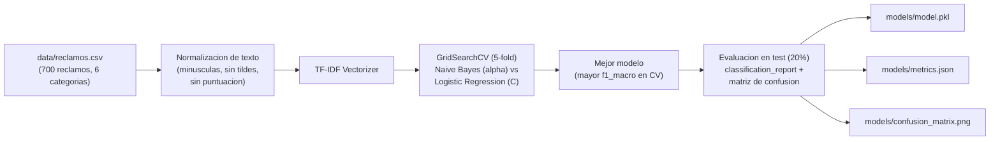
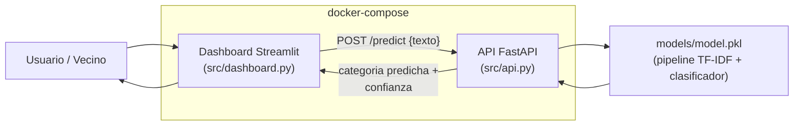
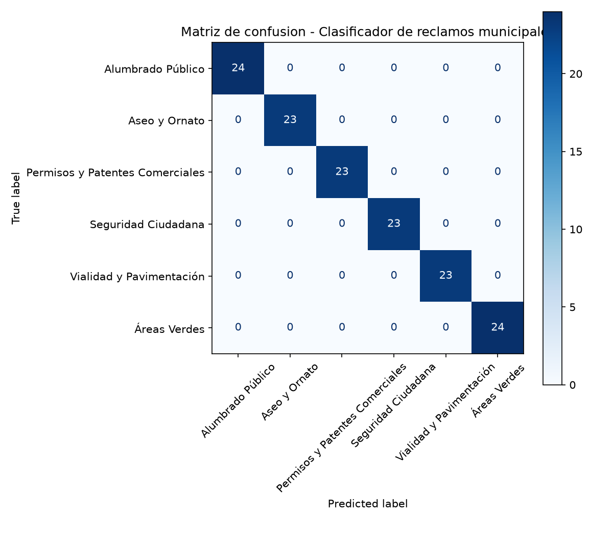

# Clasificador de Reclamos Municipales con Machine Learning

Proyecto académico (IPCHILE — actividad "Diseño, Implementación y Evaluación de una
Aplicación Web con Machine Learning") que automatiza la clasificación de reclamos
ciudadanos en una Municipalidad, derivándolos al departamento correcto mediante un
modelo de Machine Learning en vez de un proceso manual lento e inconsistente.

## Índice

- [Problema empresarial](#problema-empresarial)
- [Categorías de clasificación](#categorías-de-clasificación)
- [Dataset](#dataset)
- [Diseño de la solución ML](#diseño-de-la-solución-ml)
- [Stack tecnológico y justificación](#stack-tecnológico-y-justificación)
- [Resultados del modelo](#resultados-del-modelo)
- [Prueba de carga](#prueba-de-carga)
- [Estructura del repositorio](#estructura-del-repositorio)
- [Instalación y uso](#instalación-y-uso)
- [Cómo correr el proyecto con Docker](#cómo-correr-el-proyecto-con-docker)
- [Despliegue en producción](#despliegue-en-producción)
- [Estado del proyecto](#estado-del-proyecto)
- [Cómo se cumple la rúbrica](#cómo-se-cumple-la-rúbrica)

## Problema empresarial

En la Municipalidad, los reclamos ciudadanos se clasifican manualmente por categoría
antes de ser derivados al departamento correspondiente. Este proceso es lento e
inconsistente: dos funcionarios distintos pueden categorizar el mismo reclamo de
forma diferente, y la revisión manual retrasa la derivación. El objetivo de este
proyecto es automatizar esa clasificación con un modelo de ML, reduciendo tiempos de
derivación y mejorando la consistencia del proceso.

## Categorías de clasificación

El modelo clasifica cada reclamo en una de estas 6 categorías:

1. Aseo y Ornato
2. Vialidad y Pavimentación
3. Alumbrado Público
4. Áreas Verdes
5. Seguridad Ciudadana
6. Permisos y Patentes Comerciales

## Dataset

- **Fuente**: dataset **sintético**, generado programáticamente — no se usan datos
  reales de ninguna Municipalidad, en cumplimiento de la Ley 21.719 de Protección de
  Datos Personales.
- **Tamaño**: 700 registros, distribuidos de forma prácticamente pareja entre las 6
  categorías (116–117 registros c/u, ~14.3% cada una).
- **Columnas**: `texto` (redacción libre) y `categoria` (una de las 6 etiquetas).
- **Ubicación**: [`data/reclamos.csv`](data/reclamos.csv).
- **Redacción**: se buscó imitar cómo escribiría un vecino real — informal, sin
  tildes en buena parte de los casos, con abreviaturas coloquiales chilenas (`xq`,
  `q`, `pq`) y sin estructura formal.

> **Limitación conocida del dataset:** al ser generado con un conjunto acotado de
> plantillas por categoría (con sustitución de calles, plazas, plazos, saludos y
> cierres), el vocabulario de cada categoría queda muy delimitado. Esto hace que el
> modelo alcance métricas casi perfectas en test (ver [Resultados del
> modelo](#resultados-del-modelo)), pero ese número **no debe leerse como evidencia
> de que el problema es trivial en un caso real**: con reclamos reales, redactados
> con mayor variedad de vocabulario, ambigüedad y errores, se espera un desempeño
> menor. Este dataset es adecuado para demostrar el pipeline completo de ML de punta
> a punta (que es el objetivo de la actividad), no para certificar precisión en
> producción.
>
> **Caso real detectado y corregido:** durante pruebas manuales del dashboard
> desplegado, el reclamo *"en la avenida frente a mi casa hay un hoyo gigante"* se
> clasificó como *Alumbrado Público* en vez de *Vialidad y Pavimentación*. La causa
> raíz: la frase "frente a mi casa" aparecía en el dataset original únicamente en
> plantillas de Alumbrado Público (9/9 casos, ej. *"el poste que está frente a mi
> casa..."*), y la palabra "casa" nunca aparecía en Aseo y Ornato, Vialidad y
> Pavimentación ni Áreas Verdes — el modelo aprendió una correlación espuria por
> diseño de plantillas, no una relación semántica real. Además "avenida" no
> aparecía en ningún registro (palabra fuera de vocabulario, ignorada por el
> modelo). Se corrigió reescribiendo 8 registros existentes (sin agregar ni quitar
> filas, el balance de categorías no cambió) para introducir "avenida" y "frente a
> mi casa" también en esas tres categorías, y se reentrenó. El caso reportado ahora
> clasifica correctamente (46% Vialidad y Pavimentación vs. 21% Alumbrado Público,
> antes era 15% vs. 45%). Este episodio es en sí mismo evidencia de la limitación
> señalada arriba: un dataset sintético con plantillas acotadas puede introducir
> sesgos que no reflejan relaciones semánticas reales, y hace falta revisión manual
> con casos fuera de las plantillas para detectarlos.
>
> **Prueba adicional con vocabulario fuera del dataset:** se probaron 14 reclamos
> parafraseados, con palabras que no aparecen en `data/reclamos.csv`, contra la API
> en producción. Resultado: 10/12 casos no ambiguos clasificados correctamente
> (83%), y los 2 casos armados a propósito como ambiguos (un saludo sin
> información, y un reclamo por perros abandonados que podría ser tanto Seguridad
> Ciudadana como Áreas Verdes) obtuvieron confianza baja (25-33%) en vez de una
> respuesta segura pero arbitraria — señal de buena calibración. Los 2 fallos
> reales fueron, a diferencia del caso de arriba, simples brechas de vocabulario
> (no una correlación espuria puntual):
> - *"unos cabros rayaron toda la muralla del jardín infantil con spray"*
>   (grafiti, categoría real: Aseo y Ornato) → clasificado como *Vialidad y
>   Pavimentación* (59%). Las plantillas de Aseo dicen "rayado (graffiti)... en el
>   **muro**... sin que lo **limpien**"; ninguna usa "rayaron", "muralla" ni
>   "spray".
> - *"el semáforo... está pegado en rojo... se arma un taco terrible"* (categoría
>   real: Vialidad y Pavimentación) → clasificado como *Aseo y Ornato*, con
>   confianza muy baja (37%, casi al azar). Las plantillas de Vialidad dicen
>   "el semáforo... lleva N días **malo**... generando **tacos y accidentes**";
>   "pegado en rojo" no aparece nunca.
>
> Se optó por **no** parchear el dataset para estos dos casos puntuales: a
> diferencia del caso "frente a mi casa" (una correlación perfecta y espuria,
> fácil de aislar y corregir sin tocar el resto del dataset), esto es la
> manifestación esperada y genérica de un vocabulario acotado por plantillas —
> intentar cubrir cada sinónimo posible requeriría rehacer el dataset, no un
> ajuste puntual.
>
> **Prueba adicional con errores ortográficos fonéticos extremos:** se probaron
> 12 reclamos con ortografía fonética agresiva (k/z/b en vez de c-qu/c-s/v, letras
> dobladas, tildes y letras finales omitidas — mucho más severo que las
> abreviaturas coloquiales del dataset original) contra la API en producción.
> Resultado: **9/12 correctos (75%)**, con confianza razonable en la mayoría
> (41-95%). La causa de los 3 fallos: `text_utils.normalize_text` solo aplica
> minúsculas, elimina tildes y quita puntuación — **no hay corrector ortográfico
> ni stemmer**, así que cada palabra mal escrita es, para el TF-IDF, un token
> completamente distinto de su forma correcta ("kasa" ≠ "casa"). Cuando el error
> cae sobre palabras poco relevantes, sobrevive suficiente señal de las palabras
> intactas (por eso 9 casos con errores igual de agresivos salieron bien); cuando
> cae sobre casi todas las palabras distintivas de la categoría a la vez (ej.
> "almasen", "eskina", "bende", "serbesa", "kabros chikos" en vez de "almacén",
> "esquina", "vende", "cerveza", "cabros chicos"), no queda ninguna palabra ancla
> reconocible y la clasificación falla o queda con confianza muy baja (32-63% en
> los 3 casos).
>
> A diferencia de los dos hallazgos anteriores, esto no es un problema del
> dataset sino de la arquitectura del pipeline elegida (TF-IDF sin normalización
> morfológica). Corregirlo de fondo implicaría agregar un corrector ortográfico o
> stemmer al pipeline de `text_utils.py` — un cambio de diseño, no un ajuste de
> datos, que quedó fuera de alcance de esta iteración y se documenta aquí como
> limitación conocida en vez de implementarse sin discutirlo primero.

## Diseño de la solución ML

### EDA (Análisis Exploratorio de Datos)

El análisis exploratorio completo está en
[`notebooks/exploracion.ipynb`](notebooks/exploracion.ipynb). Resumen de los
hallazgos relevantes para el diseño del modelo:

- El dataset está **balanceado** (~14.3% por categoría) y no tiene valores nulos ni
  registros duplicados → no se necesitan técnicas de rebalanceo de clases.
- Los reclamos son **textos cortos** (mayoría entre 15 y 30 palabras) → favorece un
  enfoque de bolsa de palabras ponderada (TF-IDF) por sobre arquitecturas que
  necesitan secuencias largas para aportar valor (RNN/Transformers).
- La longitud del texto es similar entre categorías → el modelo no puede "atajar"
  clasificando solo por longitud, tiene que aprender del vocabulario real.
- Cada categoría tiene un vocabulario propio reconocible (ej. *basura/contenedor* en
  Aseo y Ornato, *hoyo/pavimento* en Vialidad, *poste/luminaria* en Alumbrado,
  *plaza/pasto* en Áreas Verdes, *robos/seguridad* en Seguridad Ciudadana,
  *patente/permiso* en Permisos), con solapamiento bajo entre categorías → confirma
  que un enfoque de bolsa de palabras es viable, y que **TF-IDF** (que pondera menos
  las palabras comunes a varias categorías) es preferible a un conteo simple.

### Flujo de entrenamiento



Implementado en [`src/train.py`](src/train.py).

### Arquitectura de inferencia



La API (`src/api.py`) expone `/predict`, `/health` y `/metrics`, documentados
automáticamente vía Swagger/OpenAPI en `/docs`. El dashboard (`src/dashboard.py`)
consume esa API por HTTP —no carga el modelo directamente—, lo que permite
escalar ambos servicios por separado, tal como quedaron efectivamente
contenerizados en [`docker-compose.yml`](docker-compose.yml) (ver [Cómo correr
el proyecto con Docker](#cómo-correr-el-proyecto-con-docker)).

## Stack tecnológico y justificación

| Decisión | Justificación |
|---|---|
| **Python 3.11+** | Estándar para proyectos de ML, ecosistema maduro. |
| **Scikit-learn (TF-IDF + Naive Bayes / Logistic Regression)**, no TensorFlow/Keras | Con ~700 registros de texto corto y 6 categorías discretas, un modelo de deep learning no tiene volumen de datos suficiente para superar a un modelo lineal clásico; además scikit-learn generaliza mejor con este tamaño de dataset y tiene menor latencia de inferencia — relevante para servir la API en un free tier. `src/train.py` compara ambos algoritmos con `GridSearchCV` en vez de asumir uno de antemano (ver [Resultados del modelo](#resultados-del-modelo)). |
| **FastAPI**, no Flask | Documentación automática vía Swagger/OpenAPI en `/docs`, requisito directo del criterio 4.1 de la rúbrica. También valida requests con Pydantic, dando mensajes de error claros al usuario. |
| **Streamlit** | Interfaz interactiva sin necesidad de HTML/CSS/JS manual, ideal para un dashboard de demostración. |
| **Docker + docker-compose** | Dos servicios (`api`, `dashboard`) reproducibles y desplegables independientemente, construidos desde un único `Dockerfile` que entrena el modelo durante el build (no depende de artefactos locales fuera de git). |
| **Render (API) + Streamlit Community Cloud (dashboard)** | Ambos con free tier suficiente para un proyecto académico. |

## Resultados del modelo

Resultado de la última ejecución de `src/train.py` (700 registros → 560 train / 140
test, estratificado, semilla 42):

- **Modelo seleccionado por `GridSearchCV`**: `MultinomialNB(alpha=0.1)`, con
  `TfidfVectorizer(ngram_range=(1,1), min_df=1)`.
- **f1_macro en validación cruzada (5-fold)**: 0.996
- **Accuracy en test**: 1.00 (140/140) — ver la nota sobre plantillas en
  [Dataset](#dataset) para la interpretación correcta de este número.

| Categoría | Precision | Recall | F1-score | Soporte |
|---|---|---|---|---|
| Aseo y Ornato | 1.00 | 1.00 | 1.00 | 23 |
| Vialidad y Pavimentación | 1.00 | 1.00 | 1.00 | 23 |
| Alumbrado Público | 1.00 | 1.00 | 1.00 | 24 |
| Áreas Verdes | 1.00 | 1.00 | 1.00 | 24 |
| Seguridad Ciudadana | 1.00 | 1.00 | 1.00 | 23 |
| Permisos y Patentes Comerciales | 1.00 | 1.00 | 1.00 | 23 |
| **macro avg** | **1.00** | **1.00** | **1.00** | **140** |
| **weighted avg** | **1.00** | **1.00** | **1.00** | **140** |



El detalle completo (incluyendo los hiperparámetros probados en la grilla y el
reporte de clasificación como JSON) queda en
[`models/metrics.json`](models/metrics.json), regenerado cada vez que se corre
`src/train.py`.

### Sobre RMSE y MAE

**RMSE (Root Mean Squared Error) y MAE (Mean Absolute Error) no aplican a este
proyecto** y por eso no aparecen en `models/metrics.json` ni arriba: ambas son
métricas de **regresión**, pensadas para medir el error entre valores numéricos
continuos. Este es un problema de **clasificación multiclase** sobre categorías
discretas sin orden natural entre sí (no tiene sentido, por ejemplo, decir que
"Alumbrado Público" está a una distancia numérica de "Áreas Verdes"). Las métricas
correctas —y las que se reportan— son **precision, recall y F1-score por
categoría**, sus promedios macro/weighted, y la **matriz de confusión**.

## Prueba de carga

Se midió el tiempo de respuesta de `POST /predict` bajo distintos niveles de
concurrencia con [`tests/load_test.py`](tests/load_test.py): 100 requests por
nivel, contra la API corriendo nativamente en `localhost` (sin Docker, sin
latencia de red).

**Antes de optimizar** (inferencia síncrona ejecutada directamente en la
corrutina del endpoint):

| Concurrencia | Throughput | Latencia promedio | Latencia mediana | p95 | Errores |
|---|---|---|---|---|---|
| 1  | ~47 req/s  | ~21 ms  | ~20 ms  | ~30 ms  | 0 |
| 10 | ~334 req/s | ~28 ms  | ~28 ms  | ~35 ms  | 0 |
| 50 | ~281 req/s | ~116 ms | ~127 ms | ~186 ms | 0 |

Con esos resultados se detectó el problema: la latencia crecía fuertemente a
partir de concurrencia=50 porque el pipeline de scikit-learn (normalización +
TF-IDF + clasificador) es código síncrono que corría dentro de la misma
corrutina de FastAPI, bloqueando el único hilo del event loop de asyncio
mientras se resolvía cada predicción — las requests concurrentes quedaban en
cola en vez de superponerse. Además, la implementación original llamaba tanto
a `model.predict()` como a `model.predict_proba()`, repitiendo dos veces la
normalización y la vectorización TF-IDF del mismo texto.

**Optimización aplicada** en `src/api.py`: la inferencia ahora corre en un
thread pool (`fastapi.concurrency.run_in_threadpool`) en vez de bloquear el
event loop, y se calcula `predict_proba` una sola vez (la categoría se deriva
como el argmax de esas probabilidades, sin invocar `predict()` por separado).

**Después de optimizar:**

| Concurrencia | Throughput | Latencia promedio | Latencia mediana | p95 | Errores |
|---|---|---|---|---|---|
| 1  | ~47 req/s  | ~21 ms | ~20 ms | ~30 ms  | 0 |
| 10 | ~421 req/s | ~22 ms | ~21 ms | ~36 ms  | 0 |
| 50 | ~337 req/s | ~82 ms | ~74 ms | ~150 ms | 0 |

**Resultado:** a concurrencia=10 el throughput subió ~26% (334→421 req/s) y a
concurrencia=50 la latencia mediana bajó ~40% (127→74 ms), sin errores en
ningún nivel probado, antes ni después.

**Limitaciones de esta prueba:** se corrió contra `uvicorn` en modo desarrollo
(un solo proceso, sin `--workers`) y en `localhost`, por lo que no refleja las
condiciones de un despliegue real (recursos compartidos y latencia de red del
free tier de Render). Sirve para detectar cuellos de botella de la aplicación
—como el que se encontró y corrigió aquí—, no como un SLA de producción.

> **Bug encontrado y corregido en la herramienta de prueba (no en la API):** al
> volver a correr `tests/load_test.py` en una sesión posterior, la latencia
> medida daba ~2048 ms **planos en los tres niveles de concurrencia**, ~100x
> peor que la tabla de arriba y sin el patrón esperado (más concurrencia →
> más latencia). La causa era el propio script: usaba `requests.post(...)`
> suelto, que crea una `Session` nueva en cada llamada; en Windows, cada
> `Session` nueva dispara una detección de proxy del sistema (WinHTTP) que
> puede tardar 1-2 segundos, un costo que no tiene nada que ver con la API y
> que antes se pagaba en *cada una* de las N requests. Se corrigió
> reutilizando una única `Session` para todas las requests del script y
> agregando una fase de *warm-up* (una request descartada por cada worker
> thread antes de empezar a medir), ya que cada thread nuevo del
> `ThreadPoolExecutor` paga ese costo por separado la primera vez que lo usa.
> Con la corrección, concurrencia=1 bajó de ~2048 ms a ~3 ms de latencia
> mediana. A concurrencia 10 y 50 todavía aparecen ocasionalmente 1-2
> outliers de ~2 s en el máximo (no en la mediana ni, en general, en el p95),
> aparentemente por reconexiones esporádicas del mismo origen — se documenta
> como limitación conocida de correr esta prueba en Windows en vez de
> intentar eliminarla por completo, ya que es un artefacto del entorno
> cliente, no del servidor.

Para reproducirla:

```bash
python src/api.py            # en una terminal
python tests/load_test.py    # en otra
```

## Estructura del repositorio

```
reclamos-municipales-ml/
├── CLAUDE.md
├── README.md
├── requirements.txt
├── data/
│   └── reclamos.csv          # dataset sintetico (700 registros)
├── notebooks/
│   └── exploracion.ipynb     # EDA
├── src/
│   ├── text_utils.py         # normalizacion de texto (compartida train/api)
│   ├── train.py              # entrenamiento + GridSearchCV + evaluacion
│   ├── api.py                # FastAPI: /predict, /health, /metrics
│   └── dashboard.py          # Streamlit: consume la API por HTTP
├── models/
│   ├── model.pkl              # pipeline entrenado (normalizacion + TF-IDF + clasificador)
│   ├── metrics.json           # metricas de la ultima ejecucion de train.py
│   └── confusion_matrix.png
├── tests/
│   ├── test_api.py           # tests funcionales de la API (pytest)
│   └── load_test.py          # prueba de carga (script de benchmarking manual)
├── Dockerfile                 # imagen compartida por api y dashboard (entrena el modelo en el build)
├── docker-compose.yml         # servicios "api" (8000) y "dashboard" (8501)
└── .dockerignore
```

## Instalación y uso

```bash
# 1. Clonar el repositorio y ubicarse en la carpeta del proyecto
cd reclamos-municipales-ml

# 2. Crear y activar un entorno virtual
python -m venv .venv
# Windows:
.venv\Scripts\activate
# Linux/Mac:
source .venv/bin/activate

# 3. Instalar dependencias
pip install -r requirements.txt

# 4. (Opcional) Explorar el EDA
jupyter notebook notebooks/exploracion.ipynb

# 5. Entrenar el modelo
python src/train.py
# Genera: models/model.pkl, models/metrics.json, models/confusion_matrix.png
```

`src/train.py` acepta parámetros opcionales (ver `python src/train.py --help`):
`--data-path`, `--models-dir`, `--test-size`, `--cv-folds`, `--random-state`.

```bash
# 6. Levantar la API (requiere haber entrenado el modelo en el paso anterior)
python src/api.py
# o, desde la raiz del proyecto:
uvicorn src.api:app --reload
# Documentacion interactiva: http://localhost:8000/docs

# 7. Correr los tests funcionales de la API
pytest tests/test_api.py -v
```

La API se configura por variables de entorno (todas opcionales, con default
razonable): `PORT` (puerto de escucha, default `8000`), `MODEL_PATH` y
`METRICS_PATH` (rutas al modelo y a las métricas, default `models/model.pkl` y
`models/metrics.json`).

### Uso de la API

```bash
# Estado del servicio y del modelo
curl http://localhost:8000/health

# Clasificar un reclamo
curl -X POST http://localhost:8000/predict \
  -H "Content-Type: application/json" \
  -d '{"texto": "hay un hoyo enorme en mi calle y ya se pincho una rueda"}'
# -> {"categoria": "Vialidad y Pavimentación", "confianza": 0.87, "probabilidades": {...}}

# Metricas de la ultima ejecucion de entrenamiento
curl http://localhost:8000/metrics
```

Si el texto enviado es inválido (vacío, muy corto, o falta el campo `texto`), la
API responde `422` con un mensaje claro (`{"detail": "...", "errores": [...]}`) en
vez de un traceback. Si el modelo aún no fue entrenado, `/predict` responde `503`
indicando que hay que correr `python src/train.py` primero.

### Uso del dashboard

```bash
# 8. Levantar el dashboard (requiere la API corriendo en otra terminal)
streamlit run src/dashboard.py
# Se abre en http://localhost:8501

# Si la API corre en otra URL/puerto (Docker, despliegue, etc.):
API_URL=http://localhost:8000 streamlit run src/dashboard.py
```

El dashboard nunca carga el modelo directamente: siempre consulta la API por
HTTP (`API_URL`, configurable por variable de entorno, nunca hardcodeada). En
la barra lateral muestra el estado de la API (`/health`) y las métricas del
último entrenamiento (`/metrics`); en la pantalla principal permite redactar
un reclamo, ver la categoría predicha con su confianza, un gráfico de
probabilidades por categoría, y un historial de lo clasificado en la sesión.
Si la API no responde o el modelo no está disponible, se muestra un mensaje
claro en vez de un error crudo de Python.

## Cómo correr el proyecto con Docker

No hace falta crear un entorno virtual ni instalar dependencias a mano: el
`Dockerfile` instala todo, entrena el modelo (`python src/train.py`) durante
el build y deja `models/model.pkl` listo dentro de la imagen.

```bash
docker compose up --build
```

- API (Swagger): http://localhost:8080/docs
- Dashboard: http://localhost:8501

`docker-compose.yml` define dos servicios a partir de la **misma imagen**
(solo `api` declara `build:`; `dashboard` reutiliza ese mismo tag, así el
entrenamiento corre una sola vez, no dos):

- **`api`** expone el puerto `8000` interno mapeado a `8080` en el host
  (`8080:8000` — ver nota de verificación más abajo sobre por qué `8080` y no
  `8000`) y tiene un `healthcheck` sobre `/health`.
- **`dashboard`** expone el puerto `8501` y arranca con
  `API_URL=http://api:8000` — el hostname `api` lo resuelve la red interna
  que crea Docker Compose entre los servicios del mismo archivo, por eso
  nunca se hardcodea una URL. `depends_on: api: condition: service_healthy`
  hace que el dashboard espere a que la API esté realmente lista (no solo
  arrancada) antes de levantarse.

Para reentrenar con un dataset nuevo (por ejemplo, tras editar
`data/reclamos.csv`) hay que reconstruir la imagen, ya que el entrenamiento
ocurre en el build:

```bash
docker compose up --build
```

Para bajar los servicios:

```bash
docker compose down
```

> **Nota de verificación:** `docker compose up --build` se corrió de punta a
> punta (Docker 29.7.2). El build instala dependencias, copia `data/` + `src/`
> y entrena el modelo dentro de la imagen (`RUN python src/train.py`) sin
> errores. Los dos contenedores quedaron arriba — `reclamos-api` en estado
> `healthy` y `reclamos-dashboard` corriendo — y se probaron en caliente:
> `GET /health` → `{"status":"ok","model_loaded":true}`, `GET /metrics`
> devuelve el reporte completo del modelo, `POST /predict` con un texto de
> ejemplo ("hay un hoyo enorme en la calle...") clasificó correctamente como
> *Vialidad y Pavimentación* con 95% de confianza, y el dashboard respondió
> `HTTP 200` en `http://localhost:8501`.
>
> El único ajuste necesario fue el mapeo de puertos del servicio `api`: en la
> máquina de desarrollo el puerto `8000` del host ya estaba ocupado por otro
> proceso ajeno a este proyecto, así que `docker-compose.yml` mapea
> `8080:8000` (el contenedor sigue escuchando en `8000` internamente; el
> healthcheck y la comunicación interna `dashboard → api` no cambian). Si en
> tu máquina el `8000` está libre, podés volver a `"8000:8000"` sin ningún
> otro cambio.

## Despliegue en producción

El proyecto está desplegado en dos servicios independientes, sin URLs
hardcodeadas (el dashboard lee la API por la variable de entorno `API_URL`,
tal como en `docker-compose.yml`):

- **API (FastAPI)** en [Render](https://render.com), a partir del
  `Dockerfile` del repo, definido como *Infrastructure as Code* en
  [`render.yaml`](render.yaml):
  **https://reclamos-municipales-api.onrender.com** —
  [`/docs`](https://reclamos-municipales-api.onrender.com/docs) (Swagger).
- **Dashboard (Streamlit)** en
  [Streamlit Community Cloud](https://streamlit.io/cloud), apuntando a
  `src/dashboard.py`, con `API_URL` configurada como *Secret* apuntando a la
  URL de Render de arriba:
  **https://reclamos-municipales-ml.streamlit.app**

> **Nota — free tier de Render:** el servicio se "duerme" tras ~15 minutos
> sin tráfico. La primera request luego de ese período tarda entre 30 y 50
> segundos en responder (cold start) mientras el contenedor arranca de
> nuevo; las siguientes son inmediatas. El dashboard muestra un spinner
> durante la espera, no un error.
>
> Ambos despliegues se verificaron end-to-end: `GET /health` responde
> `{"status":"ok","model_loaded":true}`, `GET /metrics` devuelve el reporte
> completo, y una clasificación de prueba ("hace 2 semanas que no anda
> ningún poste de luz...") se resolvió correctamente como *Alumbrado
> Público* con 99.7% de confianza, tanto desde la API directamente como
> desde el dashboard en vivo.

## Estado del proyecto

- [x] Dataset sintético (`data/reclamos.csv`)
- [x] EDA (`notebooks/exploracion.ipynb`)
- [x] Entrenamiento + evaluación del modelo (`src/train.py`)
- [x] API FastAPI (`src/api.py`) — endpoints `/predict`, `/health`, `/metrics`
- [x] Tests funcionales con pytest (`tests/test_api.py`)
- [x] Dashboard Streamlit (`src/dashboard.py`)
- [x] Prueba de carga documentada (`tests/load_test.py`)
- [x] Dockerfile + docker-compose.yml (probado end-to-end con Docker real, ver [Cómo correr el proyecto con Docker](#cómo-correr-el-proyecto-con-docker))
- [x] Despliegue (API en [Render](https://reclamos-municipales-api.onrender.com), dashboard en [Streamlit Community Cloud](https://reclamos-municipales-ml.streamlit.app), ver [Despliegue en producción](#despliegue-en-producción))

Esta sección se irá marcando a medida que se completen los pasos siguientes del
proyecto.

## Cómo se cumple la rúbrica

| Criterio | Nivel Destacado exige | Dónde se cumple |
|---|---|---|
| 3.1 Diseño de solución ML | Diseño completo con justificación clara y documentación detallada | [EDA](notebooks/exploracion.ipynb) + [Diseño de la solución ML](#diseño-de-la-solución-ml) (diagramas de flujo) + [Stack tecnológico y justificación](#stack-tecnológico-y-justificación) |
| 3.2 App interactiva (Streamlit) | App optimizada, intuitiva y escalable | [`src/dashboard.py`](src/dashboard.py): `st.cache_resource` (sesión HTTP reutilizada) y `st.cache_data` (métricas), feedback visual de carga (`st.spinner`), manejo de errores sin tracebacks crudos, historial de sesión, y arquitectura desacoplada de la API (escalable como contenedores separados) |
| 4.1 Integración vía API | API bien documentada y funcional | [`src/api.py`](src/api.py): FastAPI con Swagger automático en `/docs`, modelos Pydantic, endpoints `/predict`, `/health`, `/metrics`, manejo de errores sin tracebacks crudos |
| 4.3 App funcional y optimizada en contexto real | Estable, eficiente y bien documentada | [`src/train.py`](src/train.py) (train_test_split, GridSearchCV, métricas completas) + [`tests/test_api.py`](tests/test_api.py) (12 tests: casos normales y de error) + [Prueba de carga](#prueba-de-carga) (cuello de botella real detectado y corregido en `src/api.py`, con antes/después medido) |

---

**Proyecto académico — IPCHILE.**
